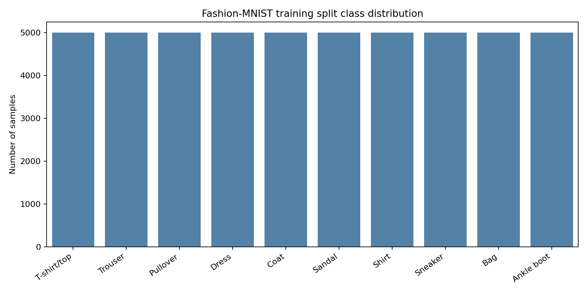
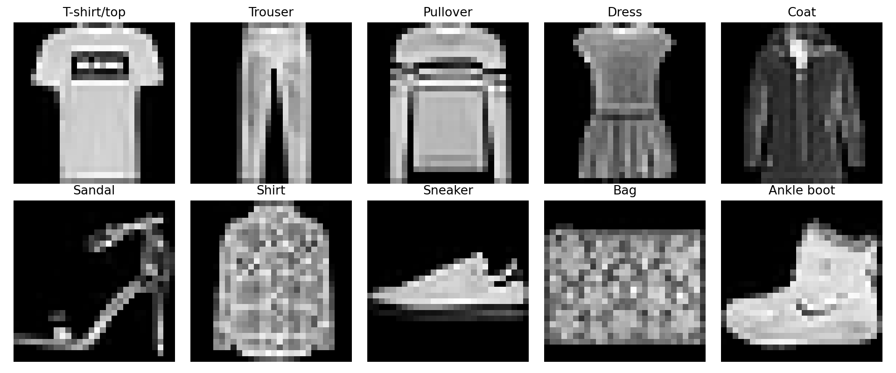
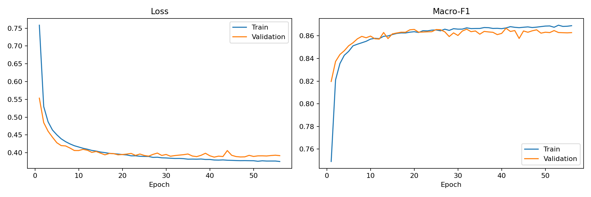
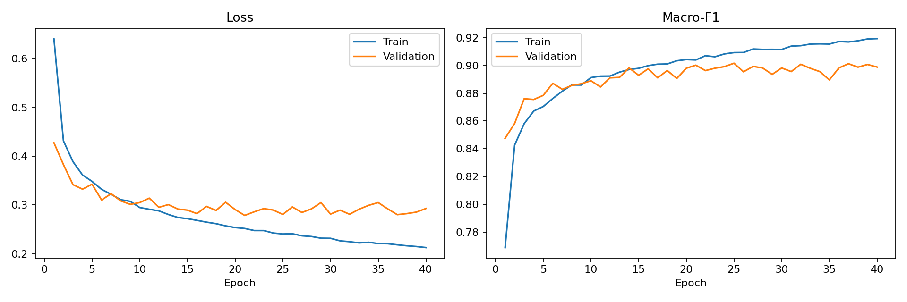
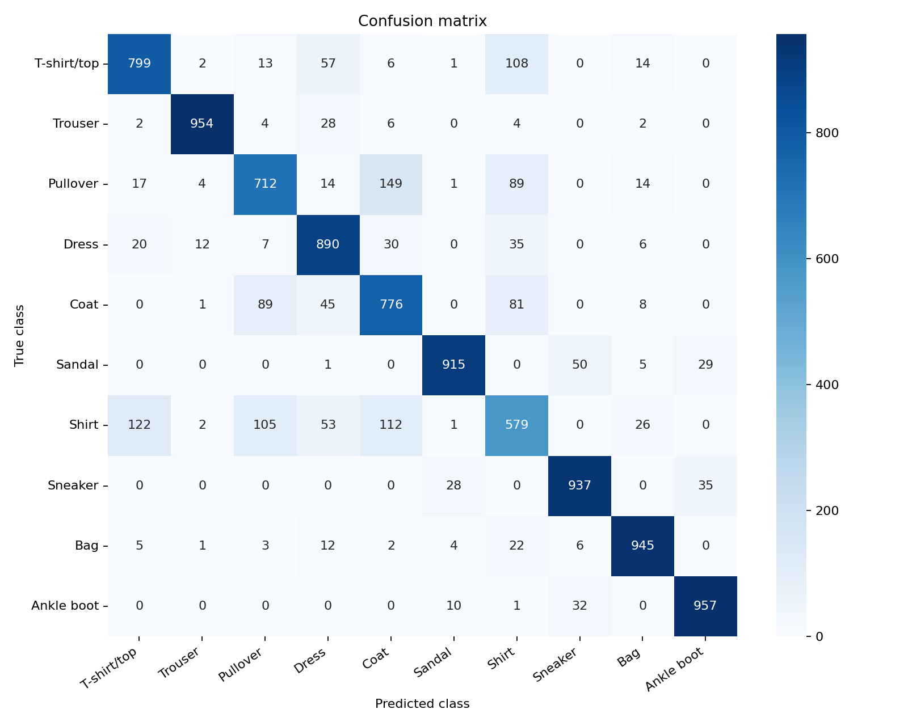
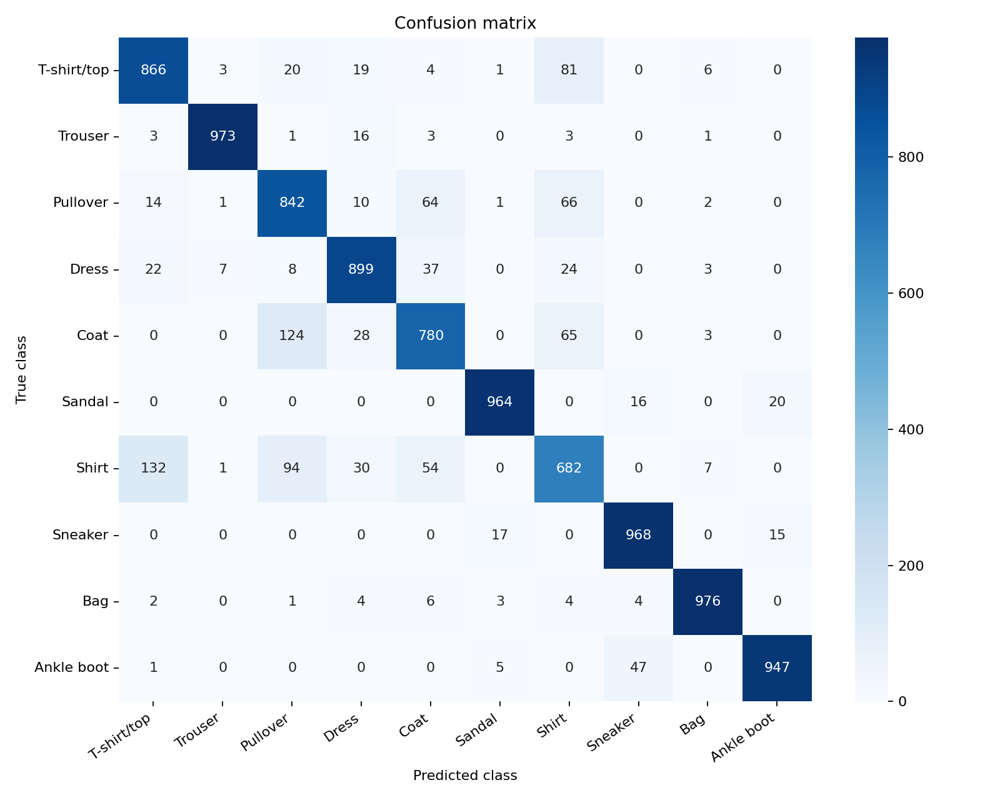
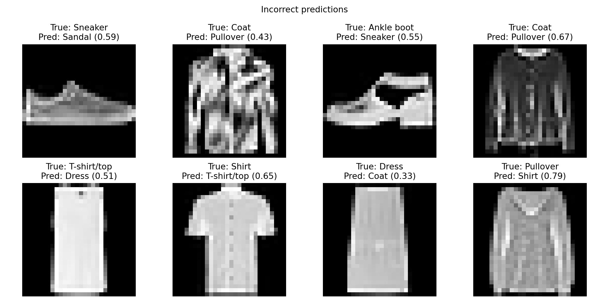
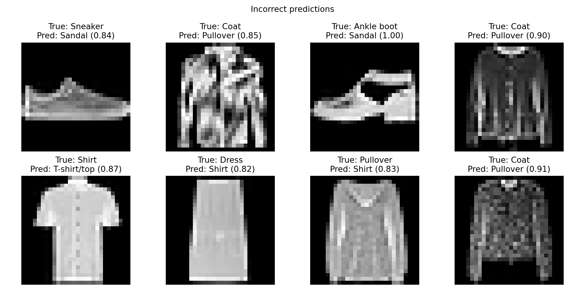

# Assignment 1 — Fashion-MNIST Baselines

## Linear and Multilayer Perceptron Classification

**Group 99 — PTQ:** Nguyen Minh Phuc, Nguyen Thanh The, Nguyen Minh Quang

## Milestone scope

The 23 September milestone establishes a reproducible Fashion-MNIST pipeline
and compares two baseline classifiers: a linear model and a multilayer
perceptron (MLP). CNN, RNN, and Transformer experiments are reserved for later
Assignment 1 milestones and are not included in the current result table.

## Dataset and exploratory analysis

Fashion-MNIST contains grayscale `28 × 28` images from ten balanced clothing
classes. A saved stratified split is created from the official training set:

| Partition | Samples | Samples per class |
|---|---:|---:|
| Training | 50,000 | 5,000 |
| Validation | 10,000 | 1,000 |
| Official test | 10,000 | 1,000 |

The split seed is `42` and is fixed for every model and training seed. The
training subset has mean `0.286276` and standard deviation `0.353185` after
scaling pixels to `[0, 1]`. Additional normalization and augmentation are
disabled for this controlled baseline.

## Models

| Model | Architecture | Parameters |
|---|---|---:|
| Linear | Flatten 784 pixels, followed by one linear classification layer | 7,850 |
| MLP | Flatten, hidden layers 256 and 128, ReLU, dropout 0.2, output layer | 235,146 |

The linear classifier can only learn one affine decision boundary per class.
The MLP adds nonlinear hidden representations, allowing it to model more
complex combinations of pixels, but neither model explicitly preserves spatial
neighbourhoods.

## Experimental setup

- Batch size: `128`.
- Maximum epochs: `100`.
- Loss: cross-entropy.
- Optimizer: Adam.
- Learning rate: `0.001`.
- Weight decay: `0.0001`.
- Scheduler: disabled.
- Early stopping: validation macro-F1, patience `15`, `min_delta=0.0001`.
- Training seeds: `42`, `123`, and `2026`.
- Split seed: `42`.
- Precision: float32.
- GPU: NVIDIA GeForce RTX 4050 Laptop GPU.
- Python 3.11.15, PyTorch 2.5.1+cu121, torchvision 0.20.1+cu121.

The best checkpoint is chosen using validation macro-F1, with validation loss
as the tie-break. The official test set is evaluated only after checkpoint
selection. Inference timing measures forward passes using five warm-up batches,
three repetitions, and CUDA synchronization.

## Results

The table reports sample mean ± sample standard deviation across three seeds.

| Model | Test accuracy | Test macro-F1 | Training time (s) | Inference (ms/sample) |
|---|---:|---:|---:|---:|
| Linear | 84.58 ± 0.10% | 84.48 ± 0.14% | 250.2 ± 19.7 | 0.00109 ± 0.00001 |
| MLP | **89.18 ± 0.21%** | **89.15 ± 0.22%** | 307.2 ± 81.7 | 0.00257 ± 0.00009 |

The MLP improves test macro-F1 by approximately 4.67 percentage points. This
gain supports the value of nonlinear hidden representations. The cost is about
30 times as many parameters and approximately 2.4 times the inference time per
sample, although both models remain very small on the benchmark GPU.

Training time varies more than predictive performance because early stopping
produces different run lengths: the three MLP runs complete 40, 69, and 56
epochs. The laptop is also not a dedicated benchmark server. Accuracy and
macro-F1 remain consistent across seeds.

## Error analysis

`Shirt` is the hardest class for both models. Aggregated across three seeds, its
recall is 56.67% for Linear and 70.57% for MLP. The linear model also struggles
with `Pullover` (73.43% recall) and `Coat` (76.50%). The MLP improves these to
81.20% and 80.60%, respectively.

The most frequent Linear confusion is `Pullover → Coat`. For the MLP, it is
`Shirt → T-shirt/top`. These classes have similar silhouettes at low resolution,
and flattening removes an explicit representation of local spatial structure.

## Limitations and next steps

This milestone covers one fixed split, three training seeds, and two baseline
models without augmentation, additional normalization, a learning-rate
scheduler, or broad hyperparameter search. Runtime measurements were collected
on a laptop that may experience background load.

Later Assignment 1 work will evaluate CNN, RNN, and Transformer models under the
same 50,000/10,000 protocol. Their results should only be added after all three
seeds have been trained and evaluated with the same test policy.

## Reproduction and artifacts

- [Assignment 1 commands](https://github.com/tapstoptap/deep-learning-261/tree/main/assignment1)
- [Saved split manifest](https://github.com/tapstoptap/deep-learning-261/blob/main/assignment1/configs/splits/fashion_mnist_train50000_val10000_seed42.json)
- [Milestone benchmark artifacts](https://github.com/tapstoptap/deep-learning-261/tree/main/assignment1/results/benchmark)
- [Experiment protocol](assignment1-experiment-protocol.md)

Checkpoint binaries and raw predictions are excluded from Git. Per-seed metrics,
run identifiers, selected epochs, split hashes, curves, and confusion matrices
are retained in `assignment1/results/benchmark/`.

## AI usage disclosure

Generative AI assisted with configuration planning, implementation, test
creation, result checking, and documentation drafting. All experiments were run
locally and verified from saved outputs. See the repository
[AI usage log](https://github.com/tapstoptap/deep-learning-261/blob/main/AI_USAGE.md).
